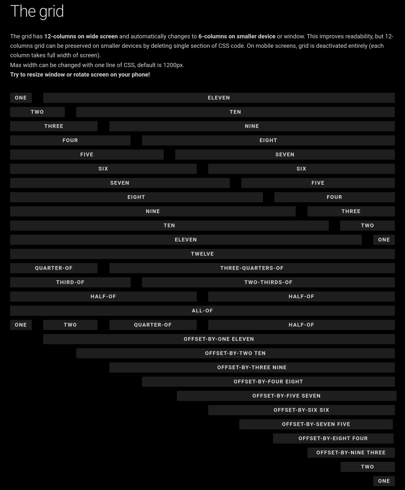
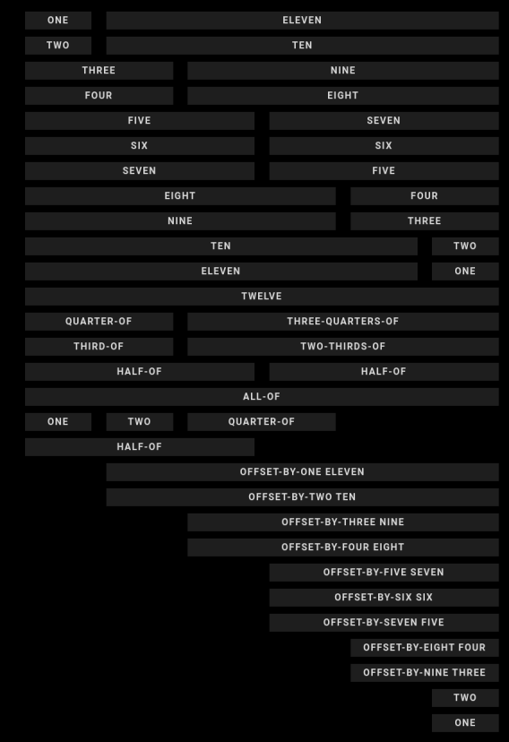
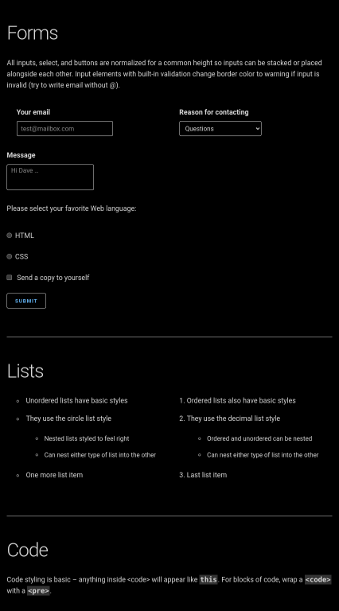

# Skeletoni CSS

Skeletoni is based on the great [Skeleton](http://www.getskeleton.com) boilerplate. Skeletoni was created in 2025 mostly for industrial aplications which require fast development, readability, touch control, responsive layout and light/dark
mode but not animations or fancy features.

Skeletoni CSS is single file with less than 1000 lines. For more complex but still simple alternative see [Pico CSS](https://picocss.com/docs/classless).

Download skeletoni.css and test.html to see all it does. Below are some screenshots from test.html:

12-column Skeletoni grid on desktop

6-column Skeletoni grid on mobile

Skeletoni color palette

Forms styled by Skeletoni

